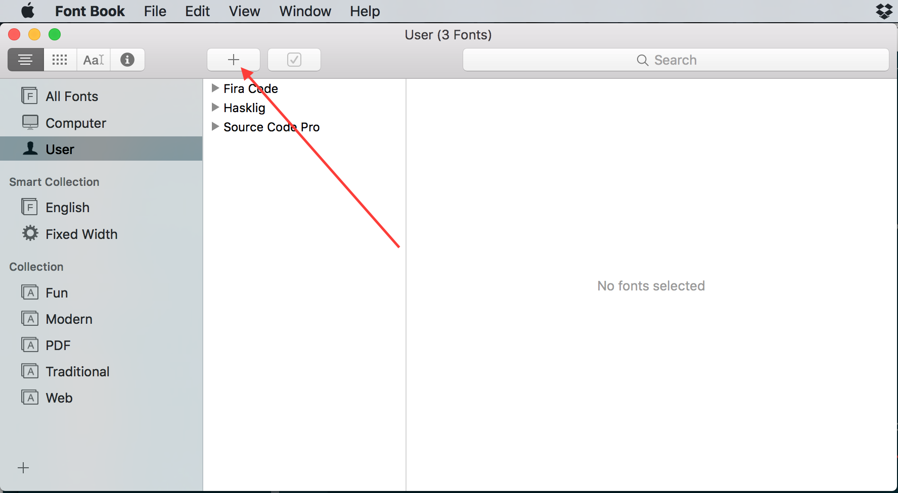

dotfiles
========

## Setup

From a command-line in either Linux or Mac OSX:

```
git clone https://github.com/tmux-plugins/tpm ~/.tmux/plugins/tpm
./install.sh
```

tpm (Tmux Plugin Manager) needed to install tmux-resurrect

### Google Drive configuration

To allow me to have files that are private, and to allow you to override
any of the files that are present in this repository, the installation
script will attempt to link things from `${HOME}/Google Drive/dotfiles`
in the corresponding directories.

Likewise, the `.bash_profile` that is included here will look to source
any files in `${HOME}/Google Drive/dotfiles/bash_profile_includes`.

### Fonts on OSX

There are several font packages included here. Before Yosemite, OSX made
it super easy to add fonts by allowing you to just drop them into a
directory. If you are on a version of OSX older than Yosemite, the
`install.sh` script will do just that.

If you're on a more recent version of OSX, in order to install any
fonts, you will have to go into *Font Book* to manually import them:



Click on the plus, and choose the folder, and it should import them
correctly. Personally, I've been using Hasklig since it is Source Code
Pro + some ligatures.

### VIM Configuration

The current version uses !(https://github.com/junegunn/vim-plug)[vim-plug]
to manage VIM plugins. During installation, it will briefly open VIM
to run the plugin installation process. If you'd like to edit the list
of plugins, they are at the bottom of the `.vimrc` file.
